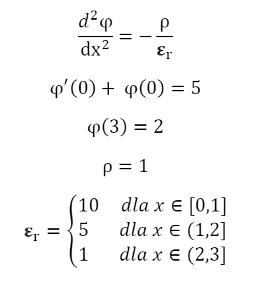
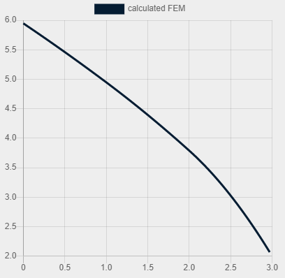

 <h1 align="center">Electric potential equation using FEM</h1>

  

  

    The problem's equation - weak form.

  

  

    Solved equation and its resolution on graph.

## Description
This repository is a project made as an assignment in the Differential Equations course 2021/22 at UST AGH.

The equation and its weak and strong forms is available [here (pdf)](doc/equation.pdf).

## Dependencies

* [linear solve](https://www.npmjs.com/package/linear-solve) - to solve final matrix
* [Gauss-Legendre Quadrature JS](https://rosettacode.org/wiki/Numerical_integration/Gauss-Legendre_Quadrature#JavaScript) - to integrate functions